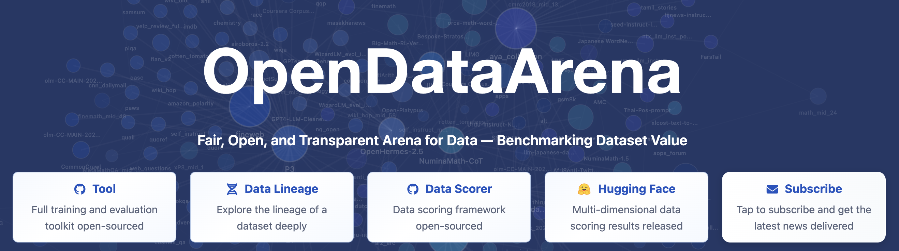
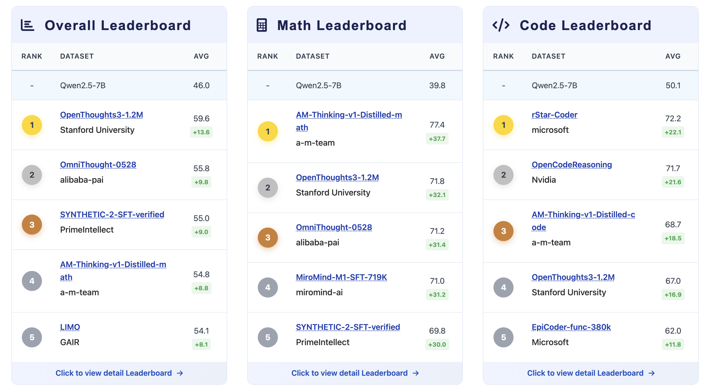
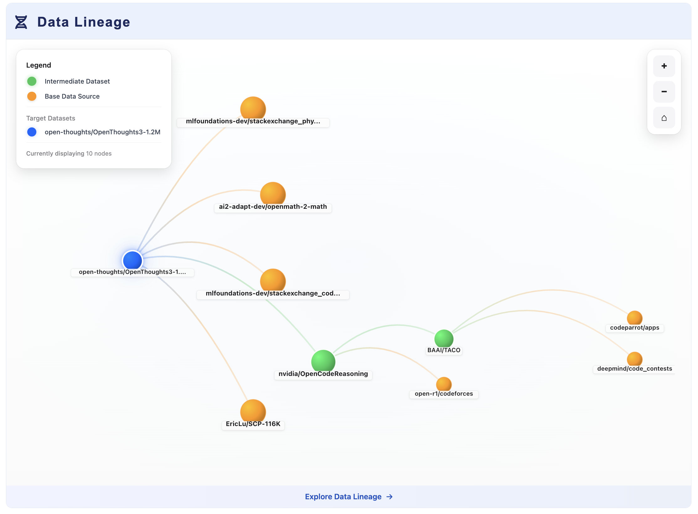
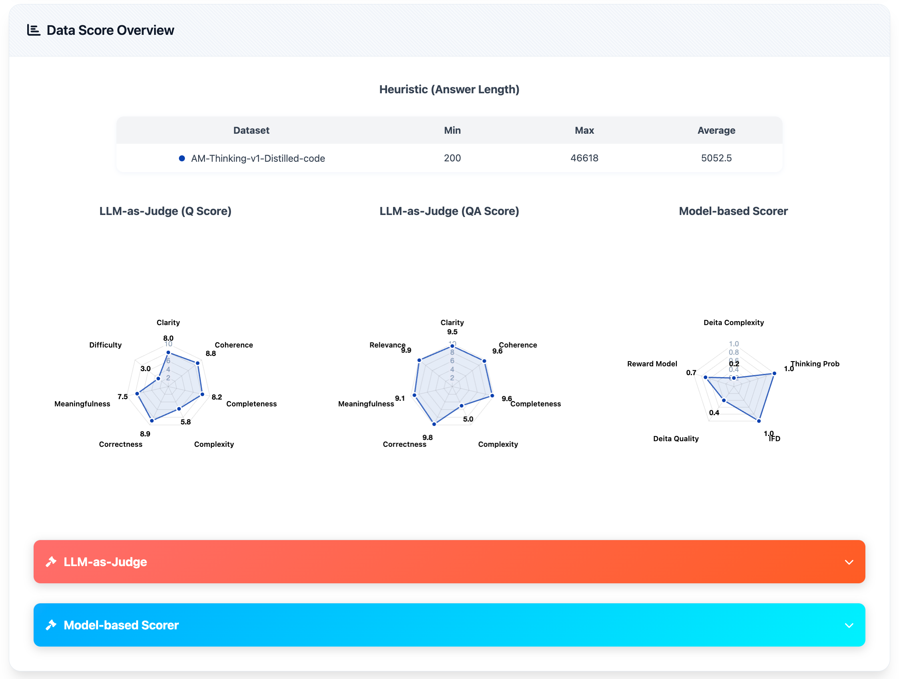
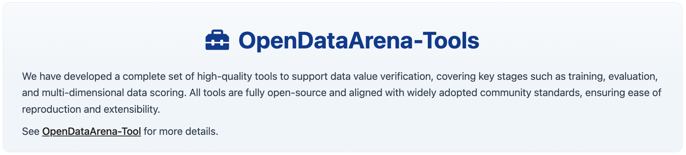

# OpenDataArena-Tool

<p align="center">
  
  <br />
  <br />
  <a href="https://arxiv.org/abs/2512.14051"></a>
  <a href="https://github.com/OpenDataArena/OpenDataArena-Tool"></a>
  <a href="https://github.com/OpenDataArena/OpenDataArena-Tool"></a>
  <a href="https://github.com/OpenDataArena/OpenDataArena-Tool/issues"></a>
  <a href="https://github.com/OpenDataArena/OpenDataArena-Tool/blob/main/LICENSE"></a>
  <!-- <a href="https://github.com/OpenDataArena/OpenDataArena-Tool/releases">
    
  </a> -->
  <a href="https://opendataarena-tool.readthedocs.io/en/latest/?badge=latest"></a>
  <br />
  <br />
  English | <a href="README_zh-CN.md">简体中文</a> 
  <br />
  <br />
  
</p>


## What's New
- 🔥 2025-12-22: We upgraded [OpenDataArena](https://opendataarena.github.io/) with Qwen3-VL for multimodal data value assessment and 79 scoring dimensions.
- 🔥 2025-12-17: We released our [OpenDataArena Technical Report](https://arxiv.org/abs/2512.14051).
- 2025-07-26: We released the [OpenDataArena](https://opendataarena.github.io/) platform and the [OpenDataArena-Tool](https://github.com/OpenDataArena/OpenDataArena-Tool) repository.

## Overview

[OpenDataArena (ODA)](https://opendataarena.github.io/) is an open, transparent, and extensible platform designed to **transform dataset value assessment from guesswork to science**. In the era of large language models (LLMs), data is the critical fuel driving model performance — yet its value has long remained a "black box". ODA aims to make every post-training dataset **measurable, comparable, and verifiable**, enabling researchers to understand what data truly matters.

ODA introduces an open "data arena" where datasets **compete under equal training and evaluation conditions**, allowing their contribution to downstream model performance to be measured objectively.


**Key features of the platform include:**

1. **ODA Leaderboard** 
  The core philosophy of ODA is that data value must be verified through real-world training. By establishing a standardized "proving ground," ODA moves beyond subjective quality assessment to empirical performance tracking.

  * **Unified Benchmarking**: Evaluates post-training data across multiple domains (General, Math, Code, Science, and Long-Chain Reasoning) and multiple modalities (Text, Image).
  * **Standardized Environments**: Controls for variables by using fixed model scales (Llama3 / Qwen2 / Qwen3 / Qwen3-VL 7-8B) and consistent training configurations.
  

2. **Data Lineage Analysis**
  Modern datasets often suffer from high redundancy and hidden dependencies. ODA introduces the industry’s first Data Lineage Analysis tool to visualize the "genealogy" of open-source data.
  * **Structural Modeling**: Maps relationships including inheritance, mixing, and distillation between datasets.
  * **Visual Discovery**: Provides a "family tree" view to identify core data sources that are repeatedly reused across the community.
  * **Contamination Detection**: Helps researchers pinpoint potential train-test contamination and "inbreeding" issues, offering a structural explanation for why certain datasets consistently dominate leaderboards.
  

3. **Multi-dimensional Data Scoring**
  Beyond downstream performance, ODA provides a "physical examination" of the data itself. We offer a fine-grained scoring framework that analyzes the intrinsic properties of data samples.
  * **Diverse Methodology**: Combines model-based evaluation, LLM-as-a-Judge, and heuristic metrics to assess instruction complexity, response quality, and diversity.
  * **Massive Open-Source Insights**: We have open-sourced scores for over 10 million samples, allowing researchers to understand why a specific dataset is effective.
  * **Extensive Metric Library**: Support 79 scoring dimensions, enabling users to generate comprehensive quality reports with a single click.
  

4. **Train–Evaluate–Score Integration**
  A fully open, reproducible pipeline for model training, benchmark evaluation, and dataset scoring to achieve a truly meaningful comparison.
  

ODA has already covered **4+ domains**, **20+ benchmarks**, **79 scoring dimensions**, processed **120+ datasets**, evaluated **40M+ samples**, and completed over **600+ training runs** and **10K+ evaluations** — with all metrics continuing to grow.

## OpenDataArena-Tool
This repository includes the tools for ODA platform:
* [Data Scoring](./data_scorer): Assess datasets through diverse metrics and methods, including model-based methods, llm-as-judge, and heuristic methods.
* [Model Training](./model_train): Use [LLaMA-Factory](https://github.com/hiyouga/LLaMA-Factory) to supervised fine-tuning (SFT) the model on the datasets. We provide the SFT scripts for reproducible experiments on mainstream models and benchmarks.
* [Benchmark Evaluation](./model_eval): Use [OpenCompass](https://github.com/open-compass/opencompass) to evaluate the performance of the model on popular benchmarks from multiple domains (math, code, science, and general instruction). We also provide the evaluation scripts for the datasets in ODA.


## Quick Start
First, clone the repository and its submodules:
```bash
git clone https://github.com/OpenDataArena/OpenDataArena-Tool.git --recursive
cd OpenDataArena-Tool
```
Then, you can start to use the tools in ODA:
* To score your own dataset, please refer to [Data Scoring](./data_scorer) for more details.
* To train the models on the datasets in ODA, please refer to [Model Training](./model_train) for more details.
* To evaluate the models on the benchmarks in ODA, please refer to [Benchmark Evaluation](./model_eval) for more details.

## Contributors
We thank to these outstanding researchers and developers for their contributions to OpenDataArena project. Welcome to collaborate and contribute to the project!
<p align="center">
  <a href="https://github.com/gavinwxy" title="Xiaoyang Wang"></a>
  <a href="https://github.com/QizhiPei" title="Qizhi Pei"></a>
  <a href="https://github.com/orangeadegit" title="Mengzhang Cai"></a>
  <a href="https://github.com/Word2VecT" title="Zinan Tang"></a>
  <a href="https://github.com/Leey21" title="Yu Li"></a>
  <a href="https://github.com/MySunX" title="Mengyuan Sun"></a>
  <a href="https://github.com/LHL3341" title="Honglin Lin"></a>
  <a href="https://github.com/GX-XinGao" title="Xin Gao"></a>
  <br />
  <br />
  <a href="https://github.com/apeterswu" title="Lijun Wu"></a>
  <a href="https://github.com/pzs19" title="Zhuoshi Pan"></a>
  <a href="https://github.com/ming-bot" title="Chenlin Ming"></a>
  <a href="https://github.com/ChampionZhong" title="Zhanping Zhong"></a>
  <a href="https://github.com/conghui" title="Conghui He"></a>
</p>


## License
This project is licensed under the MIT License - see the [LICENSE](./LICENSE) file for details.

## Citation
If you find this project useful, please consider citing:

```bibtex
@article{cai2025opendataarena,
  title={OpenDataArena: A Fair and Open Arena for Benchmarking Post-Training Dataset Value},
  author={Cai, Mengzhang and Gao, Xin and Li, Yu and Lin, Honglin and Liu, Zheng and Pan, Zhuoshi and Pei, Qizhi and Shang, Xiaoran and Sun, Mengyuan and Tang, Zinan and others},
  journal={arXiv preprint arXiv:2512.14051},
  year={2025}
}

@misc{opendataarena_tool_2025,
  author       = {OpenDataArena},
  title        = {{OpenDataArena-Tool}},
  year         = {2025},
  url          = {https://github.com/OpenDataArena/OpenDataArena-Tool},
  note         = {GitHub repository},
  howpublished = {\url{https://github.com/OpenDataArena/OpenDataArena-Tool}},
}
```

<!-- ## Star History
 -->
