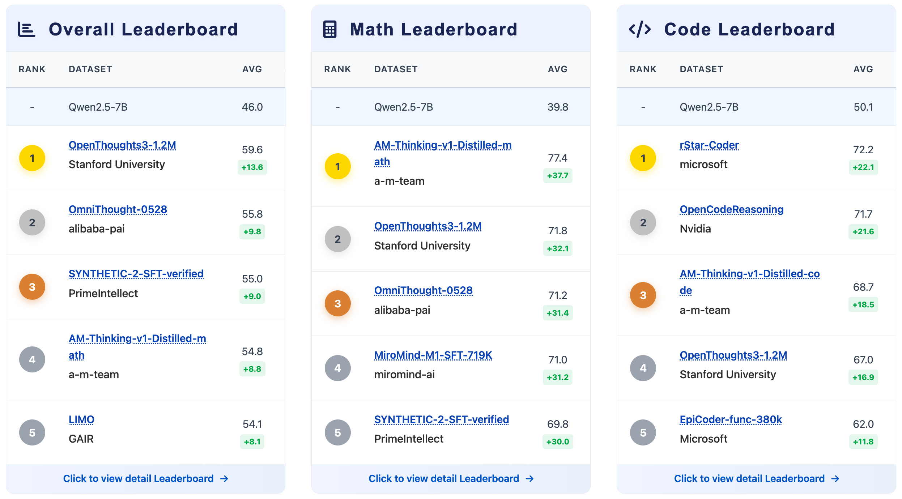
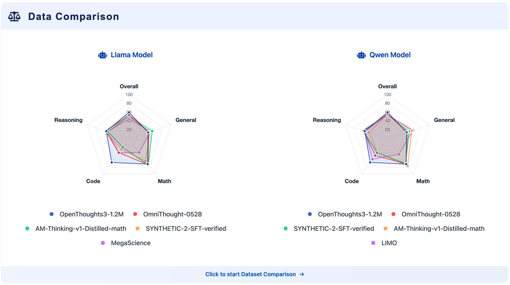

# OpenDataArena-Tool

<p align="center">
  
  <br />
  <br />
  <a href="https://github.com/OpenDataArena/OpenDataArena-Tool"></a>
  <a href="https://github.com/OpenDataArena/OpenDataArena-Tool"></a>
  <a href="https://github.com/OpenDataArena/OpenDataArena-Tool/issues"></a>
  <a href="https://github.com/OpenDataArena/OpenDataArena-Tool/blob/main/LICENSE"></a>
  <!-- <a href="https://github.com/OpenDataArena/OpenDataArena-Tool/releases">
    
  </a> -->
  <a href="https://opendataarena-tool.readthedocs.io/en/latest/?badge=latest"></a>
  <br />
  <br />
  English | <a href="README_zh-CN.md">简体中文</a>
</p>


## What's New
- 2025-07-26: We release the [OpenDataArena](https://opendataarena.github.io/) platform and the [OpenDataArena-Tool](https://github.com/OpenDataArena/OpenDataArena-Tool) repository.

## Overview
[OpenDataArena (ODA)](https://opendataarena.github.io/) is an open, transparent, and extensible platform for evaluating the value of post-training datasets, aiming to make every dataset measurable, comparable, and verifiable.


This repository includes the tools for ODA platform:
- [Data Scoring](./data_scorer): Assess datasets through diverse metrics and methods, including model-based methods, llm-as-judge, and heuristic methods.
- [Model Training](./model_train): Use [LLaMA-Factory](https://github.com/hiyouga/LLaMA-Factory) to supervised fine-tuning (SFT) the model on the datasets. We provide the SFT scripts for reproducible experiments on mainstream models and benchmarks.
- [Benchmark Evaluation](./model_eval): Use [OpenCompass](https://github.com/open-compass/opencompass) to evaluate the performance of the model on popular benchmarks from multiple domains (math, code, science, and general instruction). We also provide the evaluation scripts for the datasets in ODA.

## Quick Start
First, clone the repository and its submodules:
```bash
git clone https://github.com/OpenDataArena/OpenDataArena-Tool.git --recursive
cd OpenDataArena-Tool
```
Then, you can start to use the tools in ODA:
* To score your own dataset, please refer to [Data Scoring](./data_scorer) for more details.
* To train the models on the datasets in ODA, please refer to [Model Training](./model_train) for more details.
* To evaluate the models on the benchmarks in ODA, please refer to [Benchmark Evaluation](./model_eval) for more details.

## Contributors
We thank to these outstanding researchers and developers for their contributions to OpenDataArena project. Welcome to collaborate and contribute to the project!
<p align="center">
  <a href="https://github.com/gavinwxy" title="Xiaoyang Wang"></a>
  <a href="https://github.com/QizhiPei" title="Qizhi Pei"></a>
  <a href="https://github.com/orangeadegit" title="Mengzhang Cai"></a>
  <a href="https://github.com/Word2VecT" title="Zinan Tang"></a>
  <a href="https://github.com/Leey21" title="Yu Li"></a>
  <a href="https://github.com/MySunX" title="Mengyuan Sun"></a>
  <a href="https://github.com/LHL3341" title="Honglin Lin"></a>
  <a href="https://github.com/GX-XinGao" title="Xin Gao"></a>
  <br />
  <br />
  <a href="https://github.com/apeterswu" title="Lijun Wu"></a>
  <a href="https://github.com/pzs19" title="Zhuoshi Pan"></a>
  <a href="https://github.com/ming-bot" title="Chenlin Ming"></a>
  <a href="https://github.com/ChampionZhong" title="Zhanping Zhong"></a>
  <a href="https://github.com/conghui" title="Conghui He"></a>
</p>


## License
This project is licensed under the MIT License - see the [LICENSE](./LICENSE) file for details.

## Citation
If you find this project useful, please consider citing:

```bibtex
@misc{opendataarena_tool_2025,
  author       = {OpenDataArena},
  title        = {{OpenDataArena-Tool}},
  year         = {2025},
  url          = {https://github.com/OpenDataArena/OpenDataArena-Tool},
  note         = {GitHub repository},
  howpublished = {\url{https://github.com/OpenDataArena/OpenDataArena-Tool}},
}
```

<!-- ## Star History
 -->
