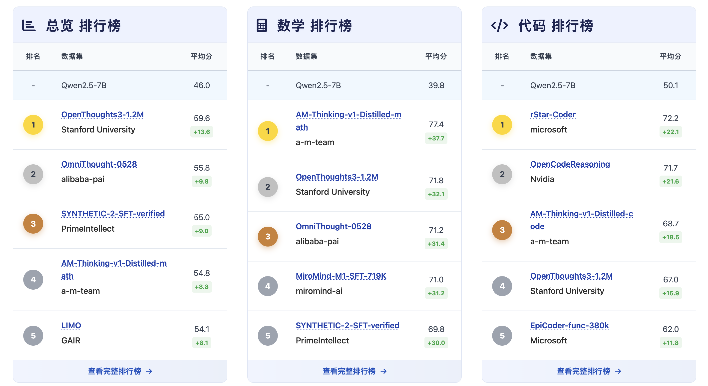
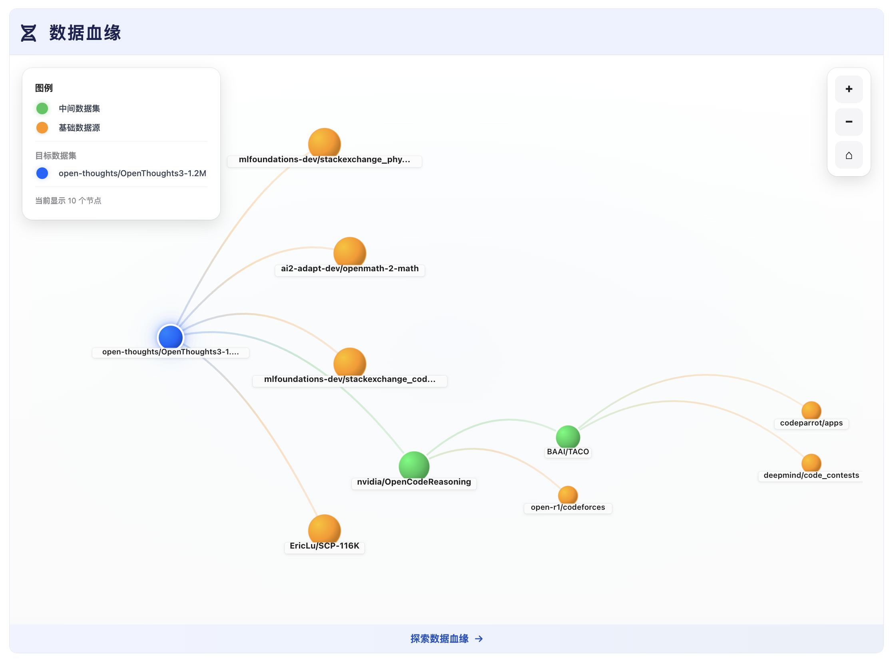
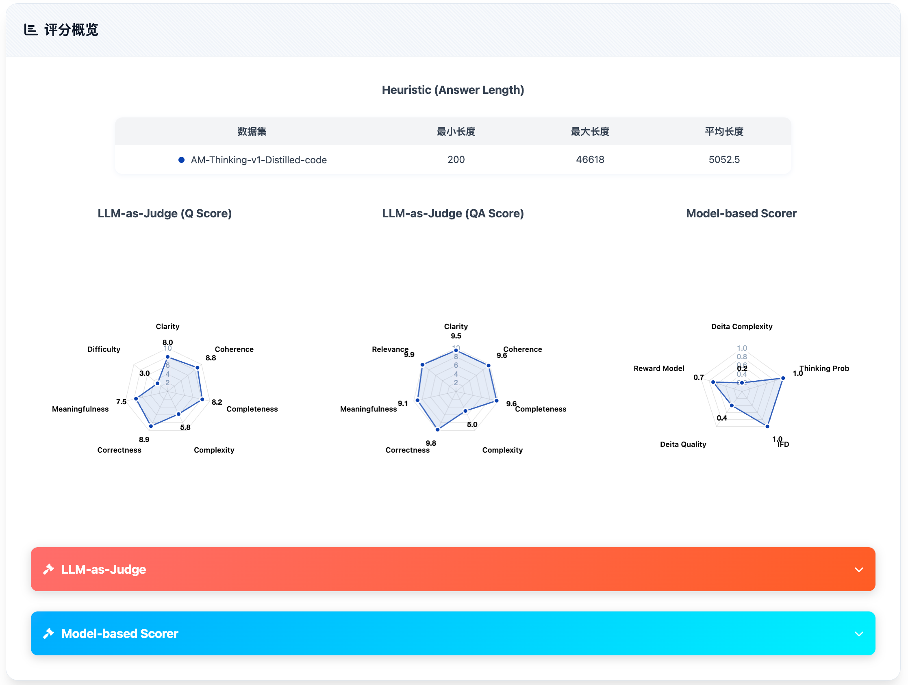
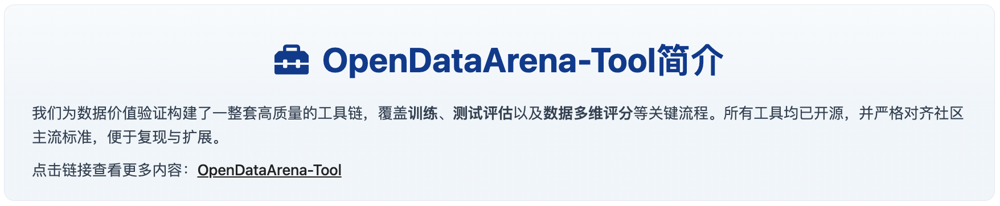

# OpenDataArena 工具

<p align="center">
  
  <br />
  <br />
  <a href="https://arxiv.org/abs/2512.14051"></a>
  <a href="https://github.com/OpenDataArena/OpenDataArena-Tool"></a>
  <a href="https://github.com/OpenDataArena/OpenDataArena-Tool"></a>
  <a href="https://github.com/OpenDataArena/OpenDataArena-Tool/issues"></a>
  <a href="https://github.com/OpenDataArena/OpenDataArena-Tool/blob/main/LICENSE"></a>
  <!-- <a href="https://github.com/OpenDataArena/OpenDataArena-Tool/releases">
    
  </a> -->
  <a href="https://opendataarena-tool.readthedocs.io/en/latest/?badge=latest"></a>
  <br />
  <br />
  <a href="README.md">English</a> | 简体中文
  <br />
  <br />
  
</p>


## 最新动态
- 🔥 2026-1-3：我们升级了 [OpenDataArena-Tool](https://github.com/OpenDataArena/OpenDataArena-Tool) 工具，支持多模态数据价值评估，请参阅 [VLM Benchmark Evaluation](./VLM_eval) 了解具体如何进行多模态大模型的训练和评测流程。
- 🔥 2025-12-22：我们升级了 [OpenDataArena](https://opendataarena.github.io/)，支持 Qwen3-VL 多模态数据价值评估及 80+ 项评分维度。
- 🔥 2025-12-17：我们发布了 [OpenDataArena 技术报告](https://arxiv.org/abs/2512.14051)。
- 2025-07-26: 我们发布了 [OpenDataArena](https://opendataarena.github.io/) 平台和 [OpenDataArena-Tool](https://github.com/OpenDataArena/OpenDataArena-Tool) 仓库。

## 概览

[OpenDataArena (ODA)](https://opendataarena.github.io/) 是一个开放、透明且可扩展的平台，旨在将**数据集价值评估从猜测转变为科学**。在大语言模型（LLM）时代，数据是驱动模型性能的关键燃料——然而，它的价值长期以来一直是一个“黑箱”。ODA 致力于让每一个后训练（post-training）数据集都**可度量、可比较、可验证**，帮助研究者真正理解哪些数据才是关键。

ODA 引入了一个开放的“数据竞技场”，在其中数据集**在相同的训练与评估条件下公平竞争**，从而能够客观地衡量它们对下游模型性能的贡献。


**该平台的主要特性包括：**

1. **ODA Leaderboard** 
  ODA 的核心理念是：数据的价值必须通过真实的模型训练来验证。通过建立标准化的“实战演练场”，ODA 超越了主观的质量评估，实现了基于实证的性能追踪。

  * **统一基准测试**：评估训练后模型在多个领域（通用、数学、代码、科学及长链推理）和多个模态（文本，图片）的表现。
  * **标准化环境**：通过使用固定的模型规模（Llama3 / Qwen2 / Qwen3 / Qwen3-VL 7-8B）和一致的训练配置来严格控制变量。
  

2. **数据血缘分析**
  现代数据集往往存在高度冗余和隐藏的依赖关系。ODA 推出了行业首个数据血缘分析工具，旨在可视化开源数据的“族谱”。
  * **结构化建模**：绘制数据集之间的继承、混合和蒸馏等演变关系图谱。
  * **可视化发现**：提供“家族树”视图，识别在社区中被反复利用的核心数据源。
  * **污染检测**：帮助研究人员精准定位潜在的“训练-测试集污染”以及数据“近亲繁殖”问题，从结构化视角解释为何某些数据集能持续领跑榜单。
  

3. **多维数据评分**
  除了下游任务的表现外，ODA 还为数据本身提供全方位的“深度体检”。我们提供了一个细粒度的评分框架，用以分析数据样本的内在属性。
  * **多样化评估方法**：结合基于模型的评估、LLM-as-a-Judge（大模型评委）以及启发式指标，综合分析指令复杂度、回答质量和多样性。
  * **海量开源数据**：我们已经开源了超过 1000 万条 样本的评分数据，帮助研究人员深入理解特定数据集为何有效。
  * **丰富的指标库**：支持 80+ 个评分维度，用户只需一键即可生成全面的数据质量报告。
  

4. **训练–评估–评分一体化** 
  提供一套完全开源、可复现的流水线，涵盖模型训练、基准评估及数据集评分，从而实现真正有意义的横向对比。
  

ODA 已覆盖 **4+ 个领域**、**20+ 个基准测试**、**80+ 个评分维度**，处理了 **120+ 个数据集**，评估了 **4000 万+ 个样本**，完成了 **600+ 次训练运行** 和 **1 万+ 次评测** —— 各项指标仍在持续增长中。

## OpenDataArena-工具
这个仓库包括了 ODA 平台的工具：
* [Data Scoring](./data_scorer): 通过多种指标和方法评估数据集，包括基于模型的方法、llm-as-judge 和启发式方法。
* [LLM Model Training](./model_train): 使用 [LLaMA-Factory](https://github.com/hiyouga/LLaMA-Factory) 在数据集上进行监督微调 (SFT)。我们提供了 SFT 脚本，用于在主流模型和基准上进行可重复实验。
* [LLM Benchmark Evaluation](./model_eval): 使用 [OpenCompass](https://github.com/open-compass/opencompass) 评估模型在多个领域（数学、代码、科学和通用）的流行基准上的性能。我们还提供了 ODA 中数据集的评估脚本。
* [VLM Benchmark Evaluation](./VLM_eval): 使用 [VLMEvalKit](https://github.com/open-compass/VLMEvalKit) 评估视觉语言模型在多个领域（空间、推理、图表和通用）的流行基准上的性能。我们还提供了 ODA 中数据集的评估方法。

## 快速开始
首先，克隆仓库及其子模块：
```bash
git clone https://github.com/OpenDataArena/OpenDataArena-Tool.git --recursive
cd OpenDataArena-Tool
```
然后，您可以开始使用 ODA 中的工具：
* 要评估您自己的数据集，请参阅 [Data Scoring](./data_scorer) 了解更多详细信息。
* 要在 ODA 中的数据集上训练模型，请参阅 [Model Training](./model_train) 了解更多详细信息。
* 要在 ODA 中的文本基准数据集上评估大语言模型，请参阅 [LLM Benchmark Evaluation](./model_eval) 了解更多详细信息。
* 要在 ODA 中的多模态基准数据集上评估多模态大模型，请参阅 [VLM Benchmark Evaluation](./VLM_eval) 了解更多详细信息。

## Contributors
我们感谢这些杰出的研究人员和开发人员对 OpenDataArena 项目的贡献。欢迎合作和贡献！
<p align="center">
  <a href="https://github.com/gavinwxy" title="Xiaoyang Wang"></a>
  <a href="https://github.com/QizhiPei" title="Qizhi Pei"></a>
  <a href="https://github.com/orangeadegit" title="Mengzhang Cai"></a>
  <a href="https://github.com/Word2VecT" title="Zinan Tang"></a>
  <a href="https://github.com/Leey21" title="Yu Li"></a>
  <a href="https://github.com/MySunX" title="Mengyuan Sun"></a>
  <a href="https://github.com/LHL3341" title="Honglin Lin"></a>
  <a href="https://github.com/GX-XinGao" title="Xin Gao"></a>
  <br />
  <br />
  <a href="https://github.com/apeterswu" title="Lijun Wu"></a>
  <a href="https://github.com/pzs19" title="Zhuoshi Pan"></a>
  <a href="https://github.com/ming-bot" title="Chenlin Ming"></a>
  <a href="https://github.com/ChampionZhong" title="Zhanping Zhong"></a>
  <a href="https://github.com/conghui" title="Conghui He"></a>
</p>


## 许可证
本项目采用 MIT 许可证 - 请参阅 [LICENSE](./LICENSE) 文件了解更多详细信息。

## 引用
如果您觉得这个项目有用，请考虑引用：

```bibtex
@article{cai2025opendataarena,
  title={OpenDataArena: A Fair and Open Arena for Benchmarking Post-Training Dataset Value},
  author={Cai, Mengzhang and Gao, Xin and Li, Yu and Lin, Honglin and Liu, Zheng and Pan, Zhuoshi and Pei, Qizhi and Shang, Xiaoran and Sun, Mengyuan and Tang, Zinan and others},
  journal={arXiv preprint arXiv:2512.14051},
  year={2025}
}

@misc{opendataarena_tool_2025,
  author       = {OpenDataArena},
  title        = {{OpenDataArena-Tool}},
  year         = {2025},
  url          = {https://github.com/OpenDataArena/OpenDataArena-Tool},
  note         = {GitHub repository},
  howpublished = {\url{https://github.com/OpenDataArena/OpenDataArena-Tool}},
}
```

<!-- ## Star History
 -->
