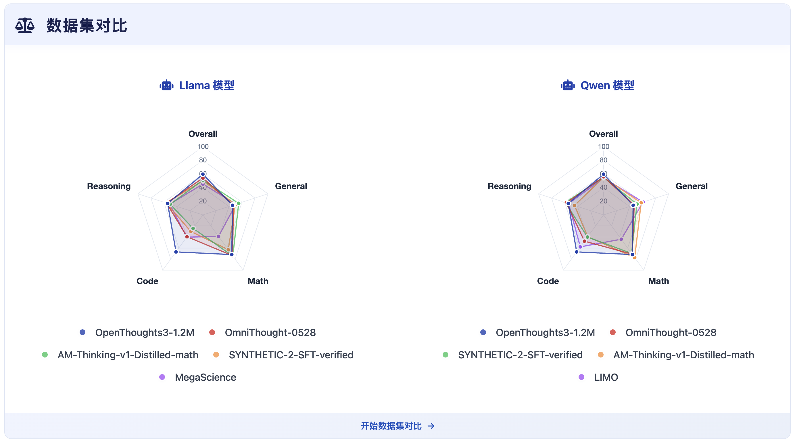

# OpenDataArena 工具

<p align="center">
  
  <br />
  <br />
  <a href="https://arxiv.org/abs/2512.14051"></a>
  <a href="https://github.com/OpenDataArena/OpenDataArena-Tool"></a>
  <a href="https://github.com/OpenDataArena/OpenDataArena-Tool"></a>
  <a href="https://github.com/OpenDataArena/OpenDataArena-Tool/issues"></a>
  <a href="https://github.com/OpenDataArena/OpenDataArena-Tool/blob/main/LICENSE"></a>
  <!-- <a href="https://github.com/OpenDataArena/OpenDataArena-Tool/releases">
    
  </a> -->
  <a href="https://opendataarena-tool.readthedocs.io/en/latest/?badge=latest"></a>
  <br />
  <br />
  <a href="README.md">English</a> | 简体中文
  <br />
  <br />
  
</p>


## 最新动态
- 🔥 2025-12-17：我们发布了 OpenDataArena 的技术报告。请参阅 [Technical Report](https://arxiv.org/abs/2512.14051)

- 2025-07-26: 我们发布了 [OpenDataArena](https://opendataarena.github.io/) 平台和 [OpenDataArena-Tool](https://github.com/OpenDataArena/OpenDataArena-Tool) 仓库。

## 概览

[OpenDataArena (ODA)](https://opendataarena.github.io/) 是一个开放、透明且可扩展的平台，旨在将**数据集价值评估从猜测转变为科学**。在大语言模型（LLM）时代，数据是驱动模型性能的关键燃料——然而，它的价值长期以来一直是一个“黑箱”。ODA 致力于让每一个后训练（post-training）数据集都**可度量、可比较、可验证**，帮助研究者真正理解哪些数据才是关键。

ODA 引入了一个开放的“数据竞技场”，在其中数据集**在相同的训练与评估条件下公平竞争**，从而能够客观地衡量它们对下游模型性能的贡献。




**该平台的主要特性包括：**

* **ODA 排行榜：** 一个面向监督微调（SFT）数据集价值的公共、跨领域、可视化排行榜。
* **多维度数据评分：** 在 20+ 个评分维度上进行细粒度评估，并开源评分数据以便复用与比较。
* **训练–评估–评分一体化：** 一个完全开放、可复现的模型训练、基准评测与数据集评分流水线。
* * **数据血缘分析：** 分析并刻画数据集之间的关联关系与依赖路径。

ODA 已覆盖 **4+ 个领域**、**20+ 个基准测试**、**60+ 个评分维度**，处理了 **100+ 个数据集**，评估了 **2000 万+ 个样本**，完成了 **600+ 次训练运行** 和 **1 万+ 次评测** —— 各项指标仍在持续增长中。

## OpenDataArena-工具
这个仓库包括了 ODA 平台的工具：
* [Data Scoring](./data_scorer): 通过多种指标和方法评估数据集，包括基于模型的方法、llm-as-judge 和启发式方法。
* [Model Training](./model_train): 使用 [LLaMA-Factory](https://github.com/hiyouga/LLaMA-Factory) 在数据集上进行监督微调 (SFT)。我们提供了 SFT 脚本，用于在主流模型和基准上进行可重复实验。
* [Benchmark Evaluation](./model_eval): 使用 [OpenCompass](https://github.com/open-compass/opencompass) 评估模型在多个领域（数学、代码、科学和通用）的流行基准上的性能。我们还提供了 ODA 中数据集的评估脚本。

## 快速开始
首先，克隆仓库及其子模块：
```bash
git clone https://github.com/OpenDataArena/OpenDataArena-Tool.git --recursive
cd OpenDataArena-Tool
```
然后，您可以开始使用 ODA 中的工具：
* 要评估您自己的数据集，请参阅 [Data Scoring](./data_scorer) 了解更多详细信息。
* 要在 ODA 中的数据集上训练模型，请参阅 [Model Training](./model_train) 了解更多详细信息。
* 要在 ODA 中的基准上评估模型，请参阅 [Benchmark Evaluation](./model_eval) 了解更多详细信息。

## Contributors
我们感谢这些杰出的研究人员和开发人员对 OpenDataArena 项目的贡献。欢迎合作和贡献！
<p align="center">
  <a href="https://github.com/gavinwxy" title="Xiaoyang Wang"></a>
  <a href="https://github.com/QizhiPei" title="Qizhi Pei"></a>
  <a href="https://github.com/orangeadegit" title="Mengzhang Cai"></a>
  <a href="https://github.com/Word2VecT" title="Zinan Tang"></a>
  <a href="https://github.com/Leey21" title="Yu Li"></a>
  <a href="https://github.com/MySunX" title="Mengyuan Sun"></a>
  <a href="https://github.com/LHL3341" title="Honglin Lin"></a>
  <a href="https://github.com/GX-XinGao" title="Xin Gao"></a>
  <br />
  <br />
  <a href="https://github.com/apeterswu" title="Lijun Wu"></a>
  <a href="https://github.com/pzs19" title="Zhuoshi Pan"></a>
  <a href="https://github.com/ming-bot" title="Chenlin Ming"></a>
  <a href="https://github.com/ChampionZhong" title="Zhanping Zhong"></a>
  <a href="https://github.com/conghui" title="Conghui He"></a>
</p>


## 许可证
本项目采用 MIT 许可证 - 请参阅 [LICENSE](./LICENSE) 文件了解更多详细信息。

## 引用
如果您觉得这个项目有用，请考虑引用：

```bibtex
@article{cai2025opendataarena,
  title={OpenDataArena: A Fair and Open Arena for Benchmarking Post-Training Dataset Value},
  author={Cai, Mengzhang and Gao, Xin and Li, Yu and Lin, Honglin and Liu, Zheng and Pan, Zhuoshi and Pei, Qizhi and Shang, Xiaoran and Sun, Mengyuan and Tang, Zinan and others},
  journal={arXiv preprint arXiv:2512.14051},
  year={2025}
}

@misc{opendataarena_tool_2025,
  author       = {OpenDataArena},
  title        = {{OpenDataArena-Tool}},
  year         = {2025},
  url          = {https://github.com/OpenDataArena/OpenDataArena-Tool},
  note         = {GitHub repository},
  howpublished = {\url{https://github.com/OpenDataArena/OpenDataArena-Tool}},
}
```

<!-- ## Star History
 -->
